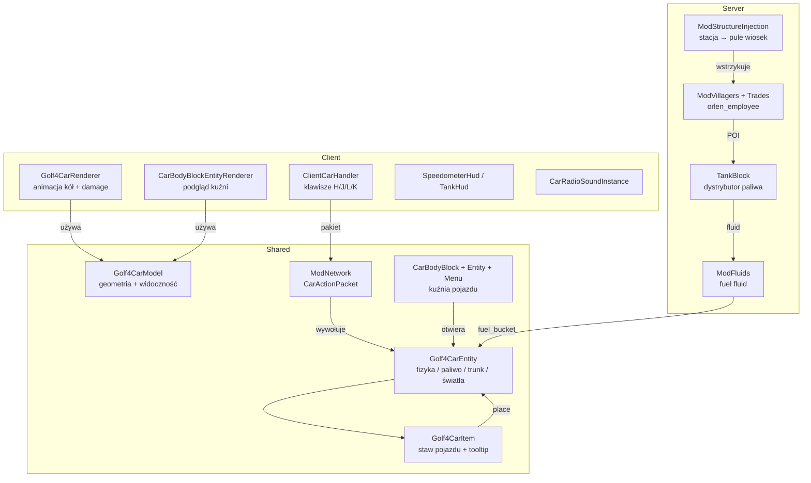

# Dokumentacja techniczna — Golf IV Mod (Forge 1.21)

> **Mod ID:** `golf4mod` | **Namespace:** `net.volkswagen.golf_iv`
> **Ostatnia aktualizacja dokumentacji:** commit `c2df561` (*Adjust car UI and model component visibility*)

---

## Spis treści

1. [Modelowanie, renderowanie i animacja](#1-modelowanie-renderowanie-i-animacja)
2. [Logika pojazdu i powiązane funkcjonalności](#2-logika-pojazdu-i-powi%C4%85zane-funkcjonalno%C5%9Bci)
3. [Stacja benzynowa, przedmioty i paliwo](#3-stacja-benzynowa-przedmioty-i-paliwo)
4. [Pozostałe pliki pomocnicze](#4-pozosta%C5%82e-pliki-pomocnicze)

---

## 1. Modelowanie, renderowanie i animacja

### 1.1 `Golf4CarModel`
**Plik:** [Golf4CarModel.java](~/Forge-1.21/src/main/java/net/volkswagen/golf_iv/client/model/Golf4CarModel.java)

Klasa definiuje pełną geometrię 3D modelu samochodu Golf IV jako `EntityModel<Golf4CarEntity>`.

#### Hierarchia części modelu

```
body
├── trunk          – bagażnik (tylna klapa)
├── steer          – kierownica
├── interior       – wnętrze kabiny
├── wheels
│   ├── front
│   │   ├── left   – lewe przednie koło
│   │   └── right  – prawe przednie koło
│   └── back
│       ├── left2  – lewe tylne koło
│       └── right2 – prawe tylne koło
├── lights
│   ├── front2     – przednie reflektory (≥2 świateł)
│   └── back2      – tylne lampy (≥4 świateł)
├── body2, body3   – dodatkowe elementy nadwozia
├── bumpers
│   ├── bumper_front
│   └── bumper_back
├── doors
│   ├── doors_left
│   └── doors_right
├── roof
├── seats          – węzeł grupujący siedzenia
│   ├── seat1      – widoczny gdy seatsCount ≥ 1
│   ├── seat2      – widoczny gdy seatsCount ≥ 2
│   └── seat3      – widoczny gdy seatsCount ≥ 5 (tylna kanapa)
└── radio          – model radia (widoczny gdy hasRadio = true)
```

Model zbudowany jest z setek sześcianów (`CubeListBuilder`) z precyzyjnymi przesunięciami UV (`texOffs`) na jednej dużej atlasie tekstur `texture_car.png`.

#### Kluczowe metody

| Metoda | Opis |
|--------|------|
| `createBodyLayer()` | Definiuje wszystkie `PartDefinition` i zwraca `LayerDefinition` rejestrowaną w systemie warstw Minecrafta |
| `updateComponents(boolean plain, boolean hasSteer, int wheelsCount, int lightsCount, int seatsCount, boolean hasRadio)` | Dynamicznie przełącza widoczność części modelu, uwzględnia też siedzenia i radio |
| `setWheelRotation(float radians)` | Ustawia kąt obrotu (`xRot`) wszystkich czterech kół jednocześnie |
| `setupAnim(...)` | Wywoływana każdą klatką renderowania (brak własnej logiki animacji – kąt kół zarządza renderer) |

**Widoczność komponentów (`updateComponents`):**

| Stan | Warunek |
|------|---------|
| `plain = true` | Ukrywa: `steer`, `wheels`, `lights`, `radio`, `seat1`, `seat2`, `seat3` |
| `steer` | `hasSteer` |
| `left` / `right` / `left2` / `right2` | `wheelsCount` ≥ 1 / 2 / 3 / 4 |
| `front2` | `lightsCount` ≥ 2 |
| `back2` | `lightsCount` ≥ 4 |
| `radio` | `hasRadio` |
| `seat1` | `seatsCount` ≥ 1 |
| `seat2` | `seatsCount` ≥ 2 |
| `seat3` | `seatsCount` ≥ 5 (tylna kanapa) |

---

### 1.2 `Golf4CarRenderer`
**Plik:** [Golf4CarRenderer.java](~/Forge-1.21/src/main/java/net/volkswagen/golf_iv/client/renderer/Golf4CarRenderer.java)

Renderer dziedziczący z `EntityRenderer<Golf4CarEntity>`. Odpowiada za wszystkie transformacje i animacje w trakcie renderowania pojazdu.

#### Stałe konfiguracyjne

| Stała | Wartość | Opis |
|-------|---------|------|
| `MODEL_SCALE` | `1.4F` | Skala modelu względem standardowego rozmiaru entity |
| `WHEEL_RADIUS_BLOCKS` | `3/16` bloków | Promień koła używany do przeliczania prędkości na obrót |
| `ROTATION_PER_BLOCK` | `≈5.33 rad/blok` | Ile radianów obrotu przypada na 1 blok przebytej drogi |
| `MIN_SPEED` | `0.001` | Minimalna prędkość uruchamiająca animację kół |

#### Algorytm animacji kół

Każde entity przechowuje stan animacji w `Map<Integer, WheelAnimState>` (kluczem jest ID entity):

```
deltaTicks = currentAge - lastAge
speed = sqrt(velX² + velZ²)
forward = dot(velocity, lookDirection)     // +/- określa kierunek obrotu
rotation += speed * deltaTicks * ROTATION_PER_BLOCK * direction
```

Obrót jest kumulowany, przycięty do zakresu `[-2π, 2π]` i przekazywany do `model.setWheelRotation()`.

#### Efekt uderzenia (damage rocking)

Gdy `entity.getHurtTime() > 0`, model jest obracany wokół osi X o kąt:
```
Mth.sin(hurtTime) * hurtTime * damage / 10.0F * hurtDir
```
Daje to efekt "kiwania" pojazdem podczas otrzymywania obrażeń.

#### Przepływ renderowania

```
render() {
  pushPose()
    translate(0, 2.1, 0)          // korekta wysokości do gruntu
    mulPose(YP, 180° - entityYaw) // obrót zgodny z kierunkiem jazdy
    [damage rocking jeśli hurt]
    scale(-1.4, -1.4, 1.4)        // skala + odbicie dla poprawnej orientacji
    model.setupAnim(...)
    model.updateComponents(...)   // widoczność części
    model.setWheelRotation(...)   // animacja kół
    model.renderToBuffer(...)
  popPose()
}
```

---

### 1.3 `CarBodyBlockEntityRenderer`
**Plik:** [CarBodyBlockEntityRenderer.java](~/Forge-1.21/src/main/java/net/volkswagen/golf_iv/client/renderer/CarBodyBlockEntityRenderer.java)

Renderer bloku kuźni (`CarBodyBlockEntity`) – wyświetla podgląd modelu samochodu **nad blokiem**, aktualizowany na żywo w miarę wkładania komponentów do slotów.

Odczytuje zawartość kontenerów:
- `slot[2]` → kierownica (`hasSteer`)
- `slot[3].getCount()` → liczba kół
- `slot[4].getCount()` → liczba siedzeń (`seatsCount`)
- `slot[6].getCount()` → liczba świateł
- `slot[8].isEmpty()` → radio (`hasRadio`)

Transformacje są identyczne jak w `Golf4CarRenderer` (ta sama skala i tekstura), ale obrót jest zawsze `180°` i brak animacji.

---

### 1.4 Tekstura i warstwa modelu

- **Tekstura:** `assets/golf4mod/textures/entity/texture_car.png`
- **Layer ID:** `golf4mod:golf4_car#main`
- Warstwa jest rejestrowana przez `ModEntityRenderers` podczas `EntityRenderersEvent.RegisterLayerDefinitions`

---

## 2. Logika pojazdu i powiązane funkcjonalności

### 2.1 `Golf4CarEntity`
**Plik:** [Golf4CarEntity.java](~/Forge-1.21/src/main/java/net/volkswagen/golf_iv/entity/Golf4CarEntity.java)

Główna klasa pojazdu. Dziedziczy z `Boat` (co zapewnia bazową obsługę pasażerów i sieciowanie) i implementuje `HasCustomInventoryScreen`, `ContainerEntity` (obsługa bagażnika).

#### Dane synchronizowane (EntityDataAccessor)

| Pole | Typ | Opis |
|------|-----|------|
| `DATA_IS_PLAIN` | Boolean | Czy pojazd jest niezłożony (brak komponentów) |
| `DATA_HAS_STEER` | Boolean | Kierownica zainstalowana |
| `DATA_HAS_TRUNK` | Boolean | Bagażnik zainstalowany |
| `DATA_TRUNK_OPEN` | Boolean | Czy bagażnik jest otwarty |
| `DATA_HAS_RADIO` | Boolean | Radio zainstalowane |
| `DATA_HAS_HONKER` | Boolean | Klakson zainstalowany |
| `DATA_RADIO_PLAYING` | Boolean | Czy radio gra |
| `DATA_FRONT_LIGHTS` | Boolean | Przednie światła włączone |
| `DATA_BACK_LIGHTS` | Boolean | Tylne światła włączone |
| `DATA_WHEELS_COUNT` | Int | Liczba kół (0–4) |
| `DATA_LIGHTS_COUNT` | Int | Liczba świateł (0–4) |
| `DATA_SEATS_COUNT` | Int | Liczba siedzeń (domyślnie 5) |
| `DATA_FUEL` | Int | Poziom paliwa w mB |

#### Parametry fizyki jazdy

| Stała | Wartość | Opis |
|-------|---------|------|
| `MIN_FORWARD_POWER` | `0.02F` | Minimalna siła przy ruszaniu |
| `MAX_FORWARD_POWER` | `0.16F` | Maksymalna siła po pełnym rozpędzie |
| `ACCEL_RAMP_TICKS` | `60` | Czas rozpędzania (ticki) do pełnej mocy |
| `REVERSE_POWER` | `0.025F` | Siła przy cofaniu |
| `GROUND_FRICTION` | `0.92F` | Współczynnik tarcia (mnożnik prędkości co tick) |
| `GRAVITY` | `0.08` | Przyspieszenie grawitacyjne w pionie |
| `TURN_SPEED` | `2.5F` | Prędkość skręcania (stopnie/tick) |
| `MIN_SPEED_TO_STEER` | `0.02` | Minimalna prędkość wymagana do skręcania |
| `CAR_STEP_HEIGHT` | `1.0F` | Wysokość, na jaką auto może wjechać bez skoku |

#### Algorytm fizyki (`applyCarPhysics()`)

Wywoływany co tick po stronie klienta kontrolującego pojazd:

```
1. Skręcanie:
   - scaleFactor = clamp(speed / 0.15, 0, 1)
   - effectiveTurn = TURN_SPEED * (0.4 + 0.6 * scaleFactor)
   - carDeltaRotation ±= effectiveTurn (jeśli lewo/prawo)
   - yaw += carDeltaRotation
   - carDeltaRotation *= 0.8 (zanik bezwładności skrętu)

2. Przyspieszenie:
   - accelerationTicks++ (do ACCEL_RAMP_TICKS)
   - ramp = accelerationTicks / ACCEL_RAMP_TICKS
   - accel = MIN_FORWARD_POWER + (MAX - MIN) * ramp²

3. Ruch:
   - dx = sin(-yaw) * accel
   - dz = cos(yaw)  * accel
   - dy = onGround ? -0.01 : vel.y - GRAVITY
   - velocity = (vel.xz * FRICTION + d.xz, dy)
```

#### Paliwo

- **Pojemność:** `MAX_FUEL_MB = 16 000 mB` (16 wiaderek)
- **Spalanie:** `BURN_PER_BLOCK = 2.0 mB/blok` przebytej odległości poziomej
- Obliczane po stronie serwera przez porównanie pozycji między tickami (`prevFuelX/Z`)
- Akumulator `fuelBurnAccumulator` pozwala spalać ułamki mB bez straty precyzji
- Tankowanie: `Shift + PPM` trzymając `fuel_bucket` → dodaje `1 000 mB`, zwraca pusty wiadro

#### Pasażerowie i układ siedzeń

| Indeks | Pozycja |
|--------|---------|
| 0 | Kierowca (lewy przód, offset X=+0.50, Z=-0.4) |
| 1 | Pasażer (prawy przód, offset X=-0.50, Z=-0.4) |
| 2 | Tył lewy (X=+0.50, Z=-1.45) |
| 3 | Tył środek (X=0, Z=-1.45) |
| 4 | Tył prawy (X=-0.50, Z=-1.45) |

Liczba dostępnych miejsc zależy od `DATA_SEATS_COUNT`. Maksymalnie 5 pasażerów.

#### Kolizje z mobami

Każdy tick sprawdzane są encje w promieniu `0.2` od bounding boxa. Jeśli LivingEntity nie jest pasażerem i prędkość kolizji > `0.03 bl/tick`:
- Zadawane obrażenia: `speed * 8.0`
- Mob dostaje impuls: `dirX * 1.5, 0.4, dirZ * 1.5`

Dodatkowo, encja jest odpychana (`this.push(e)`) tylko gdy `collisionSpeed > 0.03`, co zapobiega niechcianemu odpychaniu stojących przy aucie graczy/mobów.

#### System świateł (`updateRealLights()`)

Wywoływany co tick po stronie serwera:

**Reflektory przednie** (gdy `areFrontLightsOn()`):
- Rzucane dwa stożki promieni (kąt ±0.4 rad) z offsetów `[±0.6, 2.5]` od środka pojazdu
- Każdy promień szuka pierwszego nieprzezroczystego bloku (max 12 bloków)
- W linii promienia umieszczane są bloki `LIGHT` z poziomem rosnącym kwadratowo: `4 + ratio² * 11`
- Krawędziowe promienie stożka mają niższy poziom (`15 - edgeFactor * 9`)
- Stare bloki czyszczone przed każdą aktualizacją

**Tylne lampy** (gdy `areBackLightsOn()`):
- Jeden blok `LIGHT` na poziomie 10 umieszczany 2.2 bloku za pojazdem

**Cząsteczki (client-side):** Cząsteczki `FLAME` z tyłu. Zastosowano offsety: `backOffset: 2.85`, `sideOffset: 0.7`, Wysokość `Y: +0.33`.

#### Bagażnik

- 27 slotów (`CONTAINER_SIZE`)
- `ChestMenu.threeRows(...)` — standardowy layout skrzyni
- Otwieranie: `Shift + PPM` na pojazd (bez przedmiotu w ręce, gdy `hasTrunk()`)
- Animacja otwierania: `trunkOpen` interpoluje do 1.0 z krokiem `0.2F/tick`
- Stan zapisywany w NBT przez `ContainerEntity`

#### Funkcje interaktywne

| Akcja | Wywołanie | Wymaganie |
|-------|-----------|-----------|
| Klakson `honk()` | Klawisz **H** | `hasHonker() = true` |
| Radio `toggleRadio()` | Klawisz **J** | `hasRadio() = true` |
| Przednie światła | Klawisz **L** | `lightsCount >= 2` |
| Tylne światła | Klawisz **K** | `lightsCount >= 4` |

---

### 2.2 `Golf4CarItem`
**Plik:** [Golf4CarItem.java](~/Forge-1.21/src/main/java/net/volkswagen/golf_iv/item/Golf4CarItem.java)

Przedmiot pojazdu. Stackuje się do 1 sztuki i przechowuje dane komponentów w `DataComponents.CUSTOM_DATA`.

#### Stawianie pojazdu (`use()`)

1. Raycast na blok/płyn w kierunku gracza
2. Tworzy `Golf4CarEntity` na pozycji trafienia
3. Odczytuje `CompoundTag` z `CUSTOM_DATA` i ustawia wszystkie pola encji:
   - `HasSteer`, `HasTrunk`, `HasRadio`, `HasHonker`
   - `WheelsCount`, `LightsCount`, `SeatsCount`, `FuelLevel`
4. W trybie kreatywnym (brak `CUSTOM_DATA`): ustawia pełny zestaw komponentów
5. Sprawdza kolizję (`noCollision`) przed dodaniem do świata

#### Tooltip

Wyświetla dwie sekcje:
- `── Components ──` — ✔/✘ dla każdego komponentu (zielony/czerwony)
- `── Fuel ──` — poziom paliwa w mB z procentem (kolor: zielony >50%, żółty >20%, czerwony ≤20%)
- Brak `CUSTOM_DATA` → `"Unforged"` kursywą

---

### 2.3 Kuźnia pojazdu (`CarBodyBlock` + `CarBodyBlockEntity` + `CarBodyMenu`)

#### `CarBodyBlock`
**Plik:** [CarBodyBlock.java](~/Forge-1.21/src/main/java/net/volkswagen/golf_iv/block/CarBodyBlock.java)

Blok z `RenderShape.ENTITYBLOCK_ANIMATED` — renderowanie delegowane do `CarBodyBlockEntityRenderer`. Po PPM otwiera menu kuźni (`CarBodyMenu`) przez `serverPlayer.openMenu(entity, pos)`.

#### `CarBodyBlockEntity`
**Plik:** [CarBodyBlockEntity.java](~/Forge-1.21/src/main/java/net/volkswagen/golf_iv/block/entity/CarBodyBlockEntity.java)

Przechowuje **9 slotów** (`NonNullList<ItemStack>`). Propaguje zmiany do klienta przez `ClientboundBlockEntityDataPacket`. Dane zapisywane przez `ContainerHelper`.

#### `CarBodyMenu`
**Plik:** [CarBodyMenu.java](~/Forge-1.21/src/main/java/net/volkswagen/golf_iv/menu/CarBodyMenu.java)

Menu GUI kuźni — **9 slotów z filtrowaniem** + 36 slotów ekwipunku gracza.

> [!NOTE]
> Slot `seat` (`idx=4`) **musi mieć ≥ 1 siedzenie** aby można było ukuć pojazd (warunek sprawdzany przez `canForgeCar()` w `CarBodyScreen`).

| Slot | Indeks | Pozycja GUI | Akceptowany przedmiot | Max stack |
|------|--------|-------------|----------------------|-----------|
| Silnik | 0 | (64, 33) | `engine_block` lub `engine_cup` | 1 |
| Skrzynia biegów | 1 | (64, 64) | `gearbox` | 1 |
| Kierownica | 2 | (64, 94) | `steering_wheel` lub `steering_wheel_honker` | 1 |
| Koła | 3 | (194, 33) | `wheel` | 4 |
| Siedzenia | 4 | (194, 64) | `seat` | 5 |
| Zbiornik paliwa | 5 | (194, 94) | `fuel_tank` | 1 |
| Światła *(opcjonalne)* | 6 | (16, 33) | `car_lights` | 4 |
| Bagażnik *(opcjonalne)* | 7 | (16, 64) | `trunk` | 1 |
| Radio *(opcjonalne)* | 8 | (16, 94) | `radio` | 1 |

Sloty 6–8 są oznaczone jako "opcjonalne" (`optionalSlotsActive`) i mogą być warunkowo dezaktywowane. `RestrictedSlot` waliduje typ i maksymalny rozmiar stosu.

---

### 2.5 `CarBodyScreen`
**Plik:** [CarBodyScreen.java](~/Forge-1.21/src/main/java/net/volkswagen/golf_iv/client/screen/CarBodyScreen.java)

Ekran GUI kuźni po stronie klienta. Dziedziczy z `AbstractContainerScreen<CarBodyMenu>`.

#### Stałe layoutu

| Stała | Wartość | Opis |
|-------|---------|------|
| `GUI_W` | `225` | Szerokość tekstury tła GUI |
| `GUI_H` | `222` | Wysokość tekstury tła GUI |
| `GUI_LEFT_SHIFT` | `24` | Przesunięcie w lewo całego okna |
| `CAR_RENDER_SCALE` | `12` | Skala podglądu 3D (obniżona dla lepszego dopasowania) |

#### Tekstury GUI
- **Normalne:** `textures/gui/car_gui.png`
- **Rozszerzone:** `textures/gui/car_gui_extended.png` (widoczne gdy `isExtended = true`)

#### Podgląd 3D pojazdu

W oknie kuźni wyświetlany jest **obrotowy, interaktywny podgląd** pojazdu (`dummyCar` — fikcywa instancja `Golf4CarEntity` istniejąca tylko po stronie klienta):

- **Auto-obrót:** `-1.5°/tick` (zatrzymuje się podczas przeciągania)
- **Przeciąganie myszą (LPM):** obrót osi Y (yaw), osi X (pitch) przycięty do ±45°
- **Pozycja renderowania:** X = `leftPos + 136`, Y = `topPos + 79`
- Podgląd aktualizuje się **co tick** (`containerTick`) na podstawie aktualnych slotów:
  - `slot[2]` → `setHasSteer()`
  - `slot[3]` → `setWheelsCount()`
  - `slot[4]` → `setSeatsCount()`
  - `slot[6]` → `setLightsCount()`
  - `slot[8]` → `setHasRadio()`

#### Interakcje

| Akcja | Warunek | Efekt |
|-------|---------|-------|
| **LPM na podgląd** | zawsze | Rozpoczyna przeciąganie (obrót modelu) |
| **PPM na podgląd** | `canForgeCar() = true` | Wysyła `ForgeCarPacket` do serwera — **kuje pojazd** |
| **Przycisk `[7..41]`** | zawsze | Przełącza `isExtended` (pokazuje/ukrywa opcjonalne sloty 6–8) |

#### Warunki ukucia (`canForgeCar()`)

| Slot | Wymaganie |
|------|-----------|
| `slot[0]` — silnik | niepusty |
| `slot[1]` — skrzynia | niepusta |
| `slot[2]` — kierownica | niepusta |
| `slot[3]` — koła | count == **4** |
| `slot[4]` — siedzenia | count ≥ **1** |
| `slot[5]` — zbiornik | niepusty |

---

### 2.4 `ClientCarHandler`
**Plik:** [ClientCarHandler.java](~/Forge-1.21/src/main/java/net/volkswagen/golf_iv/client/ClientCarHandler.java)

Rejestruje 4 klawisze i co tick klienta wykrywa ich wciśnięcie, wysyłając pakiety `CarActionPacket` do serwera:

| Klawisz | Domyślny | Akcja |
|---------|----------|-------|
| **H** | `GLFW_KEY_H` | `HONK` |
| **J** | `GLFW_KEY_J` | `RADIO_TOGGLE` |
| **L** | `GLFW_KEY_L` | `FRONT_LIGHTS_TOGGLE` |
| **K** | `GLFW_KEY_K` | `BACK_LIGHTS_TOGGLE` |

Zarządza też instancją `CarRadioSoundInstance` — tworzy ją gdy `car.isRadioPlaying()` i zatrzymuje gdy gracz wysiada lub radio jest wyłączone.

---

## 3. Stacja benzynowa, przedmioty i paliwo

### 3.1 Generowanie stacji — `ModStructureInjection`
**Plik:** [ModStructureInjection.java](~/Forge-1.21/src/main/java/net/volkswagen/golf_iv/worldgen/ModStructureInjection.java)

Klasa słucha zdarzenia `ServerAboutToStartEvent` i wstrzykuje niestandardową strukturę `golf4mod:orlen_station` do pięciu pul szablonów wiosek:

| Pool wiosk | Weight |
|------------|--------|
| `minecraft:village/plains/houses` | 20 |
| `minecraft:village/snowy/houses` | 20 |
| `minecraft:village/savanna/houses` | 20 |
| `minecraft:village/taiga/houses` | 20 |
| `minecraft:village/desert/houses` | 20 |

Wstrzyknięcie działa przez **refleksję** na prywatnych polach `StructureTemplatePool`:
- `rawTemplates` (Lista `Pair<StructurePoolElement, Integer>`) — dodaje nową parę (element, weight)
- `templates` (Lista `StructurePoolElement`) — dodaje element `weight` razy (wymagane przez vanilla losowanie)

Struktura stacji jest zdefiniowana w `data/golf4mod/structures/orlen_station.nbt`.

---

### 3.2 Wioska — `ModVillagers` + `ModVillagerTrades`

#### `ModVillagers`
**Plik:** [ModVillagers.java](~/Forge-1.21/src/main/java/net/volkswagen/golf_iv/villager/ModVillagers.java)

Rejestruje nowy zawód wioskowy:

| Element | ID | Opis |
|---------|----|------|
| POI Type | `golf4mod:orlen_employee_poi` | Powiązany z blokiem `TANK` |
| Profesja | `golf4mod:orlen_employee` | "Pracownik stacji Orlen" |

POI jest rejestrowane na bloku `TankBlock` — wioślarz z tą profesją będzie szukał tego bloku jako miejsca pracy. Stany bloku są ręcznie wstrzykiwane do `PoiTypes.TYPE_BY_STATE` przez refleksję (w `FMLCommonSetupEvent`).

#### `ModVillagerTrades`
**Plik:** [ModVillagerTrades.java](~/Forge-1.21/src/main/java/net/volkswagen/golf_iv/villager/ModVillagerTrades.java)

| Poziom | Handel |
|--------|--------|
| 1 (Nowicjusz) | 2 szmaragdy → 2× `hot_dog` |
| 2 (Uczeń) | 5 szmaragdów → 1× `fuel_bucket` |
| 3 (Czeladnik) | 4 szmaragdy → 2× `tire` lub 2× `wheel_rim` |
| 4 (Ekspert) | 12 szmaragdów → 1× `gearbox` / 10 szmaragdów → 1× `engine_cup` |
| 5 (Mistrz) | 64 szmaragdy → 1× `golf4_car` (bez komponentów) |

---

### 3.3 Rejestr przedmiotów — `ModItems`
**Plik:** [ModItems.java](~/Forge-1.21/src/main/java/net/volkswagen/golf_iv/item/ModItems.java)

Wszystkie przedmioty zarejestrowane przez `DeferredRegister<Item>`:

#### Komponenty pojazdu

| ID | Typ | Zastosowanie |
|----|-----|--------------|
| `car_body` | `BlockItem` | Umieszcza kuźnię pojazdu |
| `wheel_rim` | Item | Półprodukt (felga) |
| `tire` | Item | Półprodukt (opona) |
| `wheel` = rim + tire | Item | Slot koła w kuźni |
| `steering_wheel` | Item | Kierownica |
| `steering_wheel_honker` | Item | Kierownica z klaksonem |
| `engine_block` | Item | Silnik (wariant 1) |
| `engine_cup` | Item | Silnik (wariant 2) |
| `gearbox` | Item | Skrzynia biegów |
| `fuel_tank` | Item | Zbiornik paliwa |
| `car_lights` | Item | Zestaw świateł (max 4) |
| `trunk` | Item | Bagażnik (27 slotów) |
| `radio` | Item | Radio |
| `honker` | Item | Klakson (osobny, bez kierownicy) |
| `seat` | Item | Siedzenie (max 5) |

#### Pojazd

| ID | Typ | Opis |
|----|-----|------|
| `golf4_car` | `Golf4CarItem` | Przedmiot pojazdu, stackuje do 1, przechowuje dane |

#### Bloki i paliwo

| ID | Typ | Opis |
|----|-----|------|
| `tank` | `BlockItem` | Blok zbiornika paliwa (stacja) |
| `hot_dog` | Item | Jedzenie: +10 nasycenia, 0.75 saturacji |
| `kapuczina` | Item | Przedmiot dekoracyjny / tematyczny |

---

### 3.4 System paliwa — `ModFluids`
**Plik:** [ModFluids.java](~/Forge-1.21/src/main/java/net/volkswagen/golf_iv/fluid/ModFluids.java)

Rejestruje niestandardowy płyn `fuel` jako pełnoprawnny fluid Forge:

| Komponent | ID | Opis |
|-----------|----|------|
| `FluidType` | `golf4mod:fuel` | Gęstość 800, lepkość 1200, kolor biały (`0xFFFFFFFF`) |
| `ForgeFlowingFluid.Source` | `golf4mod:fuel` | Źródło płynu |
| `ForgeFlowingFluid.Flowing` | `golf4mod:flowing_fuel` | Płynąca wersja |
| `LiquidBlock` | `golf4mod:fuel` | Blok ciekłego paliwa w świecie |
| `BucketItem` | `golf4mod:fuel_bucket` | Wiadro paliwa (stackuje do 1, craftRemainder = BUCKET) |

Płyn używa właściwości: `slopeFindDistance=4`, `levelDecreasePerBlock=1`.
Tekstury: `assets/golf4mod/block/fuel_still.png` i `fuel_flow.png`.

---

### 3.5 Blok zbiornika — `TankBlock` + `TankBlockEntity`
**Plik:** [TankBlock.java](~/Forge-1.21/src/main/java/net/volkswagen/golf_iv/block/TankBlock.java)

Blok pełniący rolę dystrybutora paliwa na stacji Orlen. Obsługuje interakcje wiaderkami:

- **Puste wiadro + PPM** → pobiera 1000 mB z `TankBlockEntity` → zwraca `fuel_bucket`
- **Pełne wiadro z paliwem + PPM** → wlewa 1000 mB do `TankBlockEntity` → zwraca pusty wiadro
- Operacje sprawdzają pojemność przez `FluidUtil` / `IFluidHandler` (Simulate przed Execute)

`TankBlockEntity` przechowuje płyn przez Forge Fluid Capability (`IFluidHandler`). Jest to też punkt zainteresowania (POI) dla `orlen_employee`.

---

## 4. Pozostałe pliki pomocnicze

### Główna klasa moda
**[Golf4Mod.java](~/Forge-1.21/src/main/java/net/volkswagen/golf_iv/Golf4Mod.java)** — punkt wejścia moda, inicjalizuje wszystkie rejestry na `FMLCommonSetupEvent` i `FMLClientSetupEvent`.

### Konfiguracja
**[Config.java](~/Forge-1.21/src/main/java/net/volkswagen/golf_iv/Config.java)** — konfiguracja Forge (TOML), dostępne opcje modyfikowalność przez graczy.

### Rejestry (Registries)

| Plik | Opis |
|------|------|
| [ModBlocks.java](~/Forge-1.21/src/main/java/net/volkswagen/golf_iv/block/ModBlocks.java) | Rejestracja bloków: `CAR_BODY`, `TANK` |
| [ModBlockEntities.java](~/Forge-1.21/src/main/java/net/volkswagen/golf_iv/block/entity/ModBlockEntities.java) | Rejestracja: `CAR_BODY_BE`, `TANK_BE` |
| [ModEntityTypes.java](~/Forge-1.21/src/main/java/net/volkswagen/golf_iv/entity/ModEntityTypes.java) | Rejestracja: `GOLF4_CAR` jako `EntityType<Boat>` |
| [ModEntityRenderers.java](~/Forge-1.21/src/main/java/net/volkswagen/golf_iv/entity/ModEntityRenderers.java) | Binduje `Golf4CarRenderer` + `Golf4CarModel.LAYER_LOCATION` |
| [ModMenus.java](~/Forge-1.21/src/main/java/net/volkswagen/golf_iv/menu/ModMenus.java) | Rejestracja: `CAR_BODY_MENU` |
| [ModCreativeModeTabs.java](~/Forge-1.21/src/main/java/net/volkswagen/golf_iv/item/ModCreativeModeTabs.java) | Definiuje zakładkę kreatywną dla wszystkich przedmiotów moda |

### Sieć
**[ModNetwork.java](~/Forge-1.21/src/main/java/net/volkswagen/golf_iv/network/ModNetwork.java)** — kanał sieciowy `golf4mod:channel`. Obsługuje pakiet `CarActionPacket` z enum `Action` (HONK, RADIO_TOGGLE, FRONT_LIGHTS_TOGGLE, BACK_LIGHTS_TOGGLE). Po stronie serwera wywołuje odpowiednie metody na `Golf4CarEntity`.

### HUD klienta

| Plik | Opis |
|------|------|
| [SpeedometerHudHandler.java](~/Forge-1.21/src/main/java/net/volkswagen/golf_iv/client/SpeedometerHudHandler.java) | Renderuje prędkościomierz na ekranie gracza w pojeździe |
| [TankHudHandler.java](~/Forge-1.21/src/main/java/net/volkswagen/golf_iv/client/TankHudHandler.java) | Wyświetla poziom paliwa na HUD |
| [PlayerScaleHandler.java](~/Forge-1.21/src/main/java/net/volkswagen/golf_iv/client/PlayerScaleHandler.java) | Skaluje wyświetlanie gracza podczas jazdy (dopasowanie do siedzeń) |

### Radio
**[CarRadioSoundInstance.java](~/Forge-1.21/src/main/java/net/volkswagen/golf_iv/client/CarRadioSoundInstance.java)** — instancja dźwięku powiązana z pojazdem. Podąża za pozycją encji, odgrywa zapętlony utwór radiowy. Zarządzana przez `ClientCarHandler`.

### Inne bloki
**[Scratch.java](~/Forge-1.21/src/main/java/net/volkswagen/golf_iv/block/Scratch.java)** — plik roboczy / szkicownik (niezawierający produkcyjnego kodu).

---

## Diagram architektury


